# RAG-PDF-Assistant

Advanced RAG system for querying PDFs using FAISS, semantic embeddings and LLM reasoning.
Built with LangChain, Streamlit and OpenAI. Includes retrieval metrics and evaluation pipeline.

## Problem
This project implements an AI-powered assistant capable of answering questions over PDF documents using a Retrieval-Augmented Generation (RAG) pipeline.

The system processes documents, generates semantic embeddings, indexes them in a FAISS vector database, and retrieves the most relevant context for an LLM to generate grounded answers.

Key goals of the project:
- explore modern RAG architectures
- evaluate retrieval quality
- build a modular pipeline for experimentation with LLM-based document QA systems

## Architecture

```mermaid
flowchart TD
    A[PDF Fijo<br/>Attention is All You Need] --> B[PyPDFLoader]
    B --> C[RecursiveCharacterTextSplitter<br/>chunk_size=1000, chunk_overlap=200]
    C --> D[HuggingFace Embeddings<br/>all-MiniLM-L6-v2]
    D --> E[FAISS Vector Store<br/>persistente en disco]
    
    F[Pregunta del usuario] --> G[Retriever<br/>k=4 documentos]
    G --> E
    
    E --> H[Contexto formateado + Prompt]
    H --> I[LLM local<br/>Dolphin 3.0 Llama 3.1 8B<br/>vía LM Studio @ localhost:1234]
    
    I --> J[Respuesta generada<br/>+ Fuentes citadas<br/>+ Tiempo medido]
    
    style A fill:#000,stroke:#333
    style J fill:#000,stroke:#333
```

## Dataset
- Paper: "Attention Is All You Need" (Vaswani et al., 2017)
- 15 pages
- Hardcodeado in `data/`

## Model
- **Embeddings**: sentence-transformers/all-MiniLM-L6-v2 (local, 384 dim)
- **Vector Store**: FAISS (persistent)
- **LLM**: llama3.1-8b via LM-Studio

## Deployment
- **Local**: `streamlit run app.py`

## Results
**Actual metrics** (measured on a Windows machine):

| Answer | Time to response | Sources cited | Correct answer |
|----------|------------------|-----------------|---------------------|
| ¿Qué es el mecanismo de self-attention? | 3.96s | Sí (pág 5) | ✅ |
| ¿Cuáles son las ventajas de los Transformers vs RNN? | 8.69s | Sí | ✅ |
| Explica "scaled dot-product attention" | 4.57s | Sí (pág 3) | ✅ |
| ¿Qué es Multi-Head Attention? | 5.20s | Sí (pág 4) | ✅ |
| ¿Por qué se usa positional encoding? | 3.70s | Sí (pág 1) | ✅ |

**Average Response Time**: **5.24 segs**  
**Subjective Accuracy**: 100% (5/5 specialized questions)
